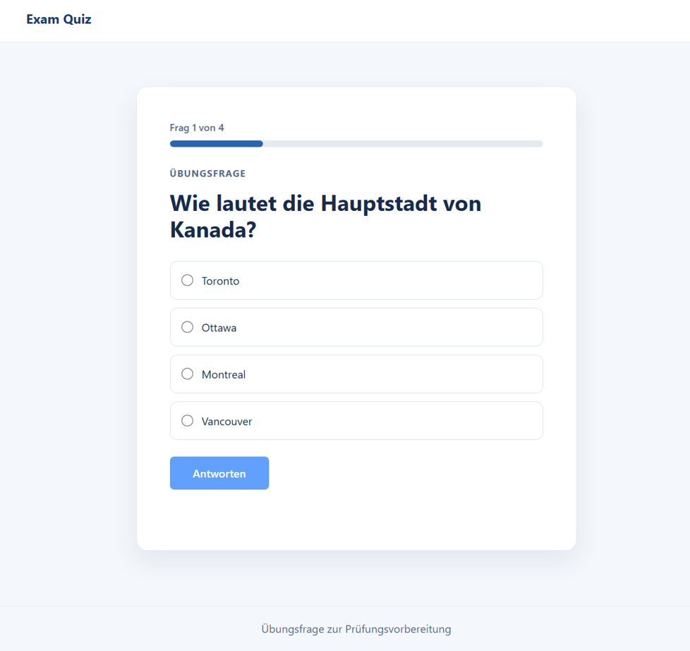
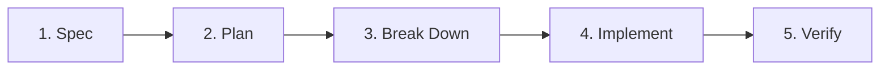

# Exam Quiz

A Questionnaire Application created using Spec Driven Development (SDD)

## Spec Driven Development

We define and agree on expected behavior before writing code, then implement and
verify it against testable acceptance criteria.

For each feature, copy [`specs/_template`](specs/_template) to `specs/<feature-name>/`:

1. **Specify** in `spec.md`: goal, user scenario, scope, and acceptance criteria.
2. **Plan** in `plan.md`: agree on the approach, affected components, and testing.
3. **Break down** in `tasks.md`: list small implementation tasks.
4. **Implement** the tasks, keeping code, tests, and specification aligned.
5. **Verify** acceptance criteria, run relevant checks, review, and commit.

See [`specs/README.md`](specs/README.md) for the workflow.
